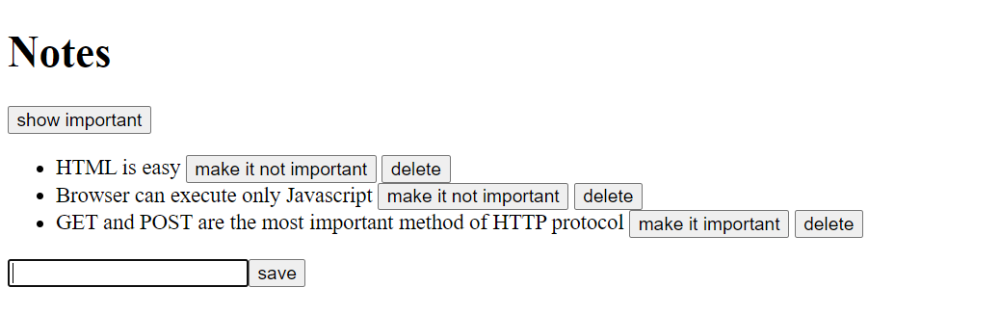

# Notebook

A simple React + Vite note-taking app that lets you create, view, mark as important, and delete notes. Notes are stored locally through JSON Server so changes persist between refreshes.

## Features

- View a list of notes loaded from a local API
- Add new notes with a form input
- Toggle a note between important and non-important
- Delete notes from the list
- Filter the list to show only important notes or all notes

## Tech Stack

- React 19
- Vite
- Axios for API requests
- JSON Server for a local REST API
- ESLint for code quality checks

## Project Structure

- src/App.jsx: main application logic and UI
- src/components/Note.jsx: individual note row component
- src/services/notes.js: API service layer for note operations
- db.json: local JSON database used by JSON Server

## Getting Started

1. Install dependencies:

   ```bash
   npm install
   ```

2. Start the JSON Server backend:

   ```bash
   npm run server
   ```

3. In a second terminal, start the Vite frontend:

   ```bash
   npm run dev
   ```

4. Open the local Vite URL shown in the terminal (usually http://localhost:5173).

## Available Scripts

- npm run dev: start the Vite development server
- npm run build: build the app for production
- npm run preview: preview the production build locally
- npm run lint: run ESLint
- npm run server: start the JSON Server backend on port 3001

## Version & Learning Notes

Aug 2nd, 2026
Added CRUD methods for the communication of React client and JSON server
Moved Notebook out as a new Repo.



